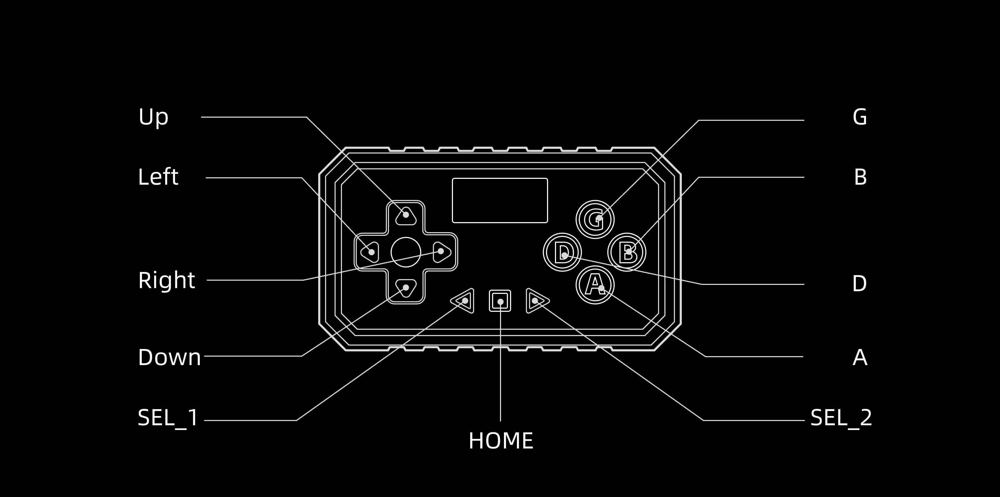

## 负鼠振动控制器

### 蓝牙特性

| 服务 UUID | 特征 UUID | 属性     | 名称          | 大小（Byte） | 说明             |
|---------|---------|--------|-------------|----------|----------------|
| 0x180C  | 0x150A  | 写      | WRITE       | 最长 20 字节 | 所有的指令都在改特性输入   |
| 0x180C  | 0x150B  | 通知     | NOTIFY      | 最长 20 字节 | 所有的回应消息都在该特性返回 |
| 0x180A  | 0x1500  | 读 / 通知 | READ/NOTIFY | 1 字节     | 电量信息           |

> 基础 UUID：0000`xxxx`\-0000\-1000\-8000\-00805f9b34fb \(将 xxxx 替换为服务 / 特性 UUID\)

### 蓝牙名称

负鼠振动控制器：47L127000

> Tip：设备开机后若搜索不到设备，请连按 5 次设备开机按钮，屏幕中蓝牙图标变为黄色即可搜索

### 蓝牙指令

负鼠所有的指令都通过 180C \-\> 150A 的特性写入

#### 50 指令

50 指令可设置 负鼠主指示灯颜色，以及开启 负鼠按键按下 / 抬起 主动上报（3bytes）。在 0x180C \-\> 0x150B 可接收到 上报的 按键 按下 / 抬起 信息

```
0x50 (1byte 指令 HEAD) + 01 (1byte 指示灯颜色) + 00/01 (1byte 停止 / 开启 按键状态集上报)
```

#### B0 指令

B0 指令写入通道振动波形数据（20bytes），每 100ms 写入。两通道数据都在同一条指令中

```
0xB0 (1byte 指令 HEAD) + 00000000000000 (7bytes 00 占位) + xxxxxxxx (4bytes A 通道振动波形数据) + 00000000 (4bytes 00 占位) + xxxxxxxx (4bytes B 通道振动波形数据)
```

##### A/B 通道振动波形数据

4 字节数据代表 100ms 的跳蛋振动波形强度，单字节代表 25ms 振动波形强度

振动波形强度值范围：0 ～ 100（0x00 ～ 0x64），4 字节中任何一个字节值超出范围，该条 B0 指令的对应通道的波形数据直接弃用

#### B3 指令

B3 指令写入通道强度（3bytes）。两通道数据都在同一条指令中

```
0xB3 (1byte 指令 HEAD) + xx (1byte A 通道强度) + xx (1byte B 通道强度)
```

##### A/B 通道强度

通道强度值范围：0 ～ 200（0x00 ～ 0xC8）

修改某个通道强度，另一通道强度不变，则使用 0xFF 表示不作修改

```TypeScript
//e.g. 将 A 通道强度设置为 160，B 通道强度不变
0xB3A0FF
//e.g. 将 B 通道强度设置为 200，A 通道强度不变
0xB3FFC8
//e.g. 将 A 通道强度设置为 10，B 通道强度设置为 20
0xB30A14
```

### 蓝牙回应消息

负鼠所有的数据回调都通过 0x180C\-\>0x150B 的特性 Notify 返回，请在成功连接传感器后对该特性绑定 notify

#### B3 消息

负鼠上报的通道强度信息（3bytes），当通过蓝牙指令或物理按键导致负鼠任何通道强度发生变化时，主动上报

```
0xB3 (1byte 消息 HEAD) + xx (1byte A 通道强度) + xx (1byte B 通道强度)
```

#### D0 消息

负鼠上报的 控制器物理按键的 按下 / 抬起 状态信息集（16bytes），当物理按键 按下 / 抬起时，主动上报

```
0xD0 (1byte 消息 HEAD) + xx (1byte 报文序号)+ xxxx (2bytes 按钮状态集) + xxxxxxxxxxxxxxxxxxxxxxxx (12bytes 其他信息)
```

##### 报文序号

0 ～ 255（0x00 ～ 0xFF）循环，每次上报自增

##### 按钮状态集

0b0 表示 抬起 / 未按下；0b1 表示 按下

| bit 位置 | \+0    | \+1    | \+2  | \+8 | \+9  | \+10 | \+11  | \+12 | \+13 | \+14 | \+15 |
|--------|--------|--------|------|-----|------|------|-------|------|------|------|------|
| 物理按键   | SEL\_1 | SEL\_2 | HOME | Up  | Down | Left | Right | B    | A    | G    | D    |




